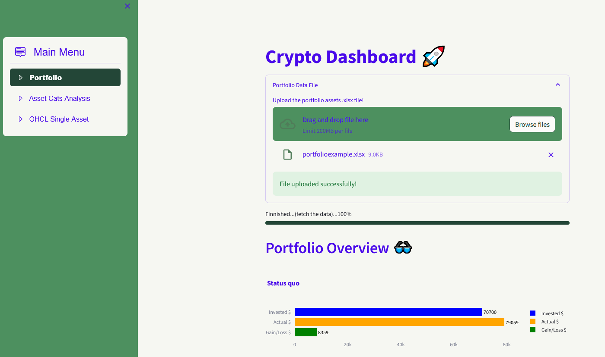

# Streamlit App for Tracking a Crypto Portfolio

## Description

The python streamlit app allows for tracking a crypto portfolio. 
The portfolio positions may be given by a .xlsx file, whose structure is highlighted in the example file "portfolioexample.xlsx".
The current and historical prices are downloaded by the app using the yfinance library.
The app allows for 
* a main overview of the portfolio with e.g. investment position vs. current position
* a deeper insight to asset categories of the portfolio, e.g. "digital gold" vs. "Layer 1" vs. "Layer 2"
* an in-depth analysis of the assets charts (dayly ohcl candlesticks with moving averages, bollinger bands and volumes)

## Getting Started

### Dependencies

* see requirements.txt
* for deployment a cloud platform like streamlit or heroku is recommended

### Executing program

* Run via local python streamlit environment, see windows batch example "batch_to_run.cmd"
* Run online (streamlit depoyment) under https://crportfolioapp-he.streamlit.app/

## Author

Tobias Hein [@ToHeinAC](https://github.com/ToHeinAC/crportfolioapp)